<!-- ━━━━━━━━━━━━━━━━━━━━━━━━━━━ HEADER BANNER ━━━━━━━━━━━━━━━━━━━━━━━━━━━ -->

<!-- ━━━━━━━━━━━━━━━━━━━━━━━ TYPING ANIMATION ━━━━━━━━━━━━━━━━━━━━━━━━━ -->

 

<!-- ━━━━━━━━━━━━━━━━━━━━━━━━━ RPG STAT BADGES ━━━━━━━━━━━━━━━━━━━━━━━━━ -->

 

  

<!-- ━━━━━━━━━━━━━━━━━━━━━━━ CHARACTER CARD ━━━━━━━━━━━━━━━━━━━━━━━━━━━ -->

 

 
 

<!-- ━━━━━━━━━━━━━━━━━━━━━━━ CONNECT / SOCIALS ━━━━━━━━━━━━━━━━━━━━━━━━ -->

 

  

> 💬 *`> DMs are always open... Let's build something epic together_`*

 

<!-- ━━━━━━━━━━━━━━━━━━━━━━━━━ TECH STACK ━━━━━━━━━━━━━━━━━━━━━━━━━━━━ -->

  

  

  

  

  

  

  

  

  

 

 

  

  <picture>
    <source media="(prefers-color-scheme: dark)" srcset="https://raw.githubusercontent.com/platane/snk/output/github-contribution-grid-snake-dark.svg" />
    <source media="(prefers-color-scheme: light)" srcset="https://raw.githubusercontent.com/platane/snk/output/github-contribution-grid-snake.svg" />
    
  </picture>

  

