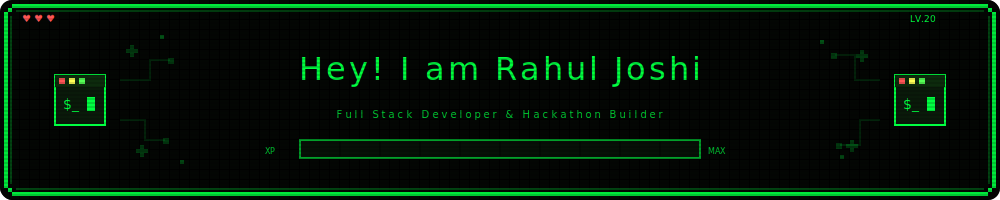
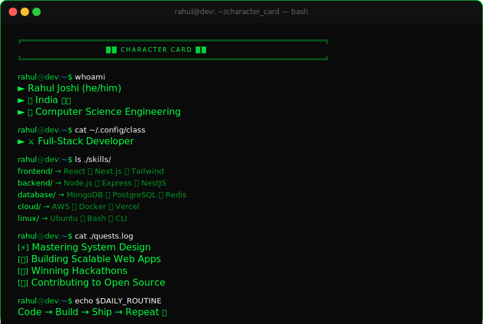

<!-- ━━━━━━━━━━━━━━━━━━━━━━━━━━━ HEADER BANNER ━━━━━━━━━━━━━━━━━━━━━━━━━━━ -->

<!-- ━━━━━━━━━━━━━━━━━━━━━━━━━ RPG STAT BADGES ━━━━━━━━━━━━━━━━━━━━━━━━━ -->

 

<!-- ━━━━━━━━━━━━━━━━━━━━━━━ CONNECT / SOCIALS ━━━━━━━━━━━━━━━━━━━━━━━━ -->

 

<!-- ━━━━━━━━━━━━━━━━━━━━━━━ CHARACTER CARD ━━━━━━━━━━━━━━━━━━━━━━━━━━━ -->

<!-- ━━━━━━━━━━━━━━━━━━━━━━━ TYPING ANIMATION ━━━━━━━━━━━━━━━━━━━━━━━━━ -->

 

<!-- ━━━━━━━━━━━━━━━━━━━━━ GITHUB STATS ━━━━━━━━━━━━━━━━━━━━━━━━━━━━━━ -->

 

<!-- ━━━━━━━━━━━━━━━ SNAKE ANIMATION ━━━━━━━━━━━━━━━━━━━━━━━━━━━━━━━━━ -->

  <picture>
    <source media="(prefers-color-scheme: dark)" srcset="https://raw.githubusercontent.com/R-Jhere/R-Jhere/output/github-snake-dark.svg" />
    <source media="(prefers-color-scheme: light)" srcset="https://raw.githubusercontent.com/R-Jhere/R-Jhere/output/github-snake.svg" />
    
  </picture>

<!-- ━━━━━━━━━━━━━━━━━━━━━━━━ QUOTE ━━━━━━━━━━━━━━━━━━━━━━━━━━━━━━━━━━ -->

